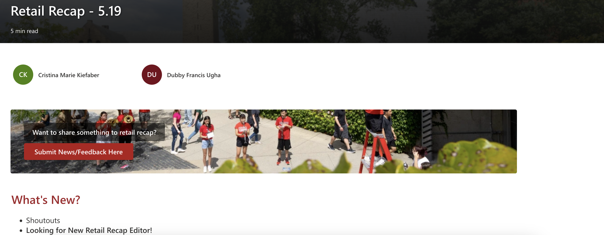

# Retail Recap

### Overview

Retail Recap is our weekly internal newsletter designed to keep Cornell Retail Services staff informed and connected. Hosted on our SharePoint site and shared via email, it includes key updates such as:

*   Shoutouts recognizing team contributions
*   Announcements on upcoming events or changes
*	Resources for staff support and reference
*	Spotlights highlighting individual team members
*	…and more

Retail Recap ensures everyone stays in the loop on what’s happening across our stores each week.

<figure markdown="span">
    
    <figcaption>Retail Recap Preview</figcaption>
    </figure>

---

## Creating Retail Recaps

1.  Navigate to the [Weekly Retail Recap Directory](https://cornellprod.sharepoint.com/sites/TheCornellStore/_layouts/15/news.aspx?title=Weekly%20Retail%20Recap&newsSource=1&instanceId=33e0d72e-31f7-4649-b472-4ef26a2903ba&webPartId=8c88f208-6c77-4bdb-86a0-0c47b4316588&serverRelativeUrl=%2Fsites%2FTheCornellStore%2FSitePages%2FSCHome.aspx&pagesListId=1c509e17-ee03-4400-bae4-631e25156cb4)

1. Select any news post you want. *Ideally, select the most recent one.*
1. Once opened, click **+ New** > **Copy of this news post**.
1. Update the **Title**.
1. **People Profiles**: Add you and collaborators profiles.
1. **What's New**: Update with a Table of Contents of finished newsletter.
1. **Shoutouts**: Check any recent shoutouts from the [Shoutouts list](https://cornellprod.sharepoint.com/sites/TheCornellStore/Lists/Shoutouts/AllItems.aspx?viewid=876c5499%2D5335%2D4fdf%2D87f9%2D5f8304f3d2d5) or ask around for Shoutouts.
1. **Upcoming Events**: For this section, you can pull the information from the (Events database)[https://cornellprod.sharepoint.com/sites/TheCornellStore/_layouts/15/Events.aspx]. 
1. **Shoutouts**: Feel free to edit or leave as is.
1. **Student/Staff Spotlight**: 

    !!! note "Preparing the Spotlights"

        The staff spotlight is meant to highlight **any** staff member at the store. Here's what you'll need:
        
        * [x] A Staff Member
        * [x] A picture of them
        * [x] Interview Questions Answered
        
         
        ***Need help drafting the interview questions?** Below are a couple suggestions of questions. Feel free to add, remove, or modify the questions.*
        
        * What is your title? 
        * How long have you been with Cornell Retail Services?
        * What is your job? 
        * What is your favorite item in store? 
        * What is your favorite restaurant in Ithaca? 
        * Tell us something most people don't know about you?

1. **For the rest of the sections:** Feel free to leave, add, or remove them. 