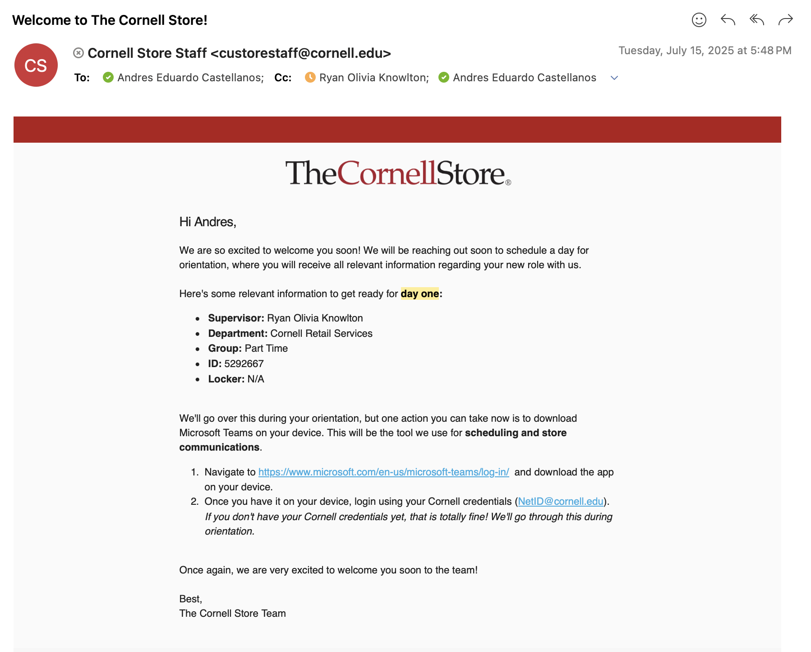
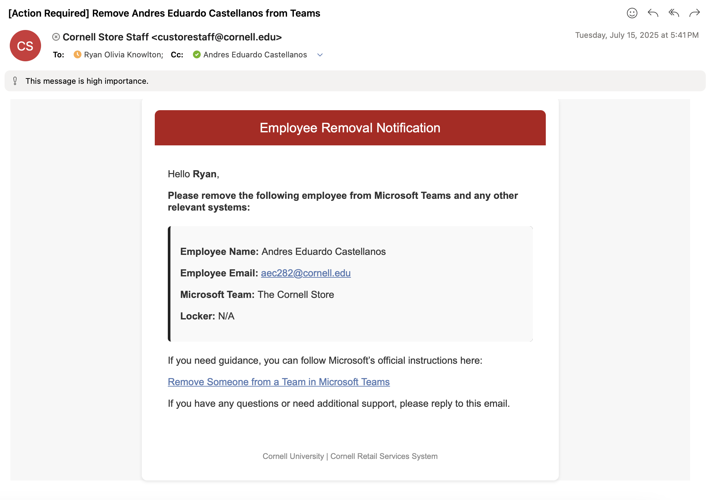
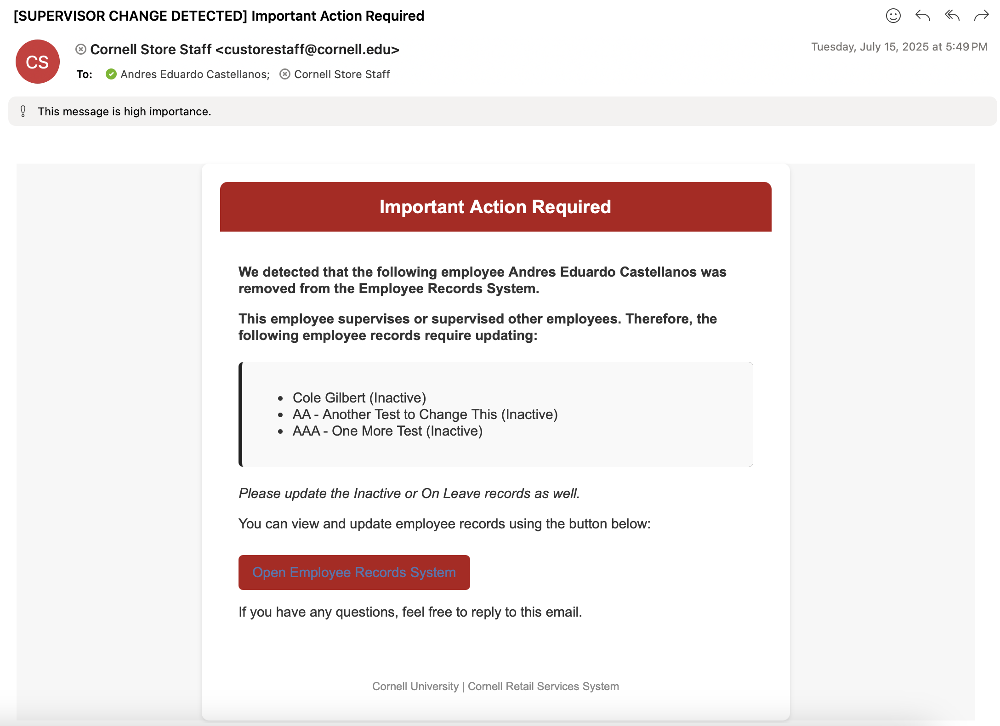

# Employee Records System
### Overview
The Employee Records System is the central tool used by Cornell Retail Services to keep track of employee information. It covers everything from when someone joins the team to when they leave.

!!! success "Using this system helps us:"
	* Keep an up-to-date list of everyone working across our stores.
	* Make sure our email lists (listservs) are accurate.
	* Maintain clear records of employee details — including students.
	* Streamline our hiring and exit processes.
	* Support other tools that rely on this information, like:
	    * Staff availability schedules
	    * Radio assignments

[View Employee Records System](https://cornellprod.sharepoint.com/sites/TheCornellStore/Lists/Shoutouts%20Entry%20Keys/All%20Employees.aspx?viewid=2232a6fb-dcfc-4632-b864-e906b224d294){ .md-button }

---
## Using the System
### Video Tutorial
<iframe width="560" height="315" src="https://www.youtube.com/embed/lnIpP_YrMjo?si=c1hByDHr5vWRA_a-" title="YouTube video player" frameborder="0" allow="accelerometer; autoplay; clipboard-write; encrypted-media; gyroscope; picture-in-picture; web-share" referrerpolicy="strict-origin-when-cross-origin" allowfullscreen></iframe>

---

### Add an Employee
!!! abstract "Requirements:"
    This step is to be completed when the following requirements have been met:

    * [x] The employee has been hired by the University and a **NetID has been created**.
    * [x] If this is a returning employee, they have **left their role at The Cornell Store for more than 6 months** (otherwise, please reactivate them).

1. Navigate to the [Employee Records System](https://cornellprod.sharepoint.com/sites/TheCornellStore/Lists/Shoutouts%20Entry%20Keys/All%20Employees.aspx?viewid=e26e8e81-2c27-4b52-8b80-8decc3754f05).
2. Click [+ New Employee](https://cornellprod.sharepoint.com/sites/TheCornellStore/Lists/Shoutouts%20Entry%20Keys/NewForm.aspx?Source=https://cornellprod.sharepoint.com/sites/TheCornellStore/Lists/Shoutouts%2520Entry%2520Keys/AllItems.aspx&ContentTypeId=0x010030863F9062F8B34DBC1C9EA3AFB5931800A5990D3F2847FF43B20056263C69BEF4&RootFolder=)
3. Fill out **all the fields**. **Unsure how to fill them out?** Refer to [this table](https://app.gitbook.com/o/3rRavcRa8DQ450prAqHc/s/r26EcyZ7VHC5kawGD8y4/~/changes/53/sharepoint-lists/projects-using-sharepoint-lists/employee-records-system).
4. Click **Save**.

??? success "Adding an Employee will:"
    * Send the **employee, their supervisor, and the creator** an onboarding email (**Ready for Day One** email).
    * Add them to the corresponding listserv (**Part-time, Full-time, or Student**) depending on employment type. 
    * If applicable, will add them to their corresponding **Team on Microsoft Teams**.

---

### Remove an Employee

!!! danger "Warning:"
    **Please refrain from deleting the record.** To identify if you are deleting instead of removing check if you are clicking a button that says delete.

1. Navigate to the [Employee Records System](https://cornellprod.sharepoint.com/sites/TheCornellStore/Lists/Shoutouts%20Entry%20Keys/All%20Employees.aspx?viewid=e26e8e81-2c27-4b52-8b80-8decc3754f05).
2. Find the employee you would like to remove from the database.
3. Click on the **red minus button** left of their name. 

When clicked, the employee's status will change to **Inactive**.

??? success "Removing an Employee will:"
    * Send the **the supervisor, and the modifier** an off-boarding email (**Off-boarding Tasks** email).
    * Remove them to the corresponding listserv (**Part-time, Full-time, or Student**) depending on employment type. 
    * If the employee is a supervisor, it will send The Cornell Store and the modifier of the record an email reporting employees that need a supervisor update.
    **Note:** While adding the employee adds them to Teams (if applicable), removing them **will not automatically revoke their access to Teams**. They must be removed from Teams manually.

---

### Reactivate an Employee
!!! abstract annotate "Requirements :"
    You may only reactivate an employee if the following requirements are met: 
    
    * [x] The employee has been previously registered in the system.
    * [x] The employee was deactivated for no more than 6 months (1) 

1.  If you cannot find them in the system, that means the employee has been deactivated and needs new registration.

Steps:

1.  Navigate to the [Employee Records System](https://cornellprod.sharepoint.com/sites/TheCornellStore/Lists/Shoutouts%20Entry%20Keys/All%20Employees.aspx?viewid=820b9f74-ccf3-4345-960c-6ac6524d8454).
1.  Ensure you are viewing the **Inactive** view (check the top right corner of the database).
1.  Find the employee you would like to **reactivate** from the database.
1.  Click on the **green check button** left of their name.

When clicked, the employee's status will change to **Active**.

??? success "Reactivating an Employee will:"
    * Send the **employee, their supervisor, and the creator** an onboarding email (**Ready for Day One** email).
    * Add them to the corresponding listserv (**Part-time, Full-time, or Student**) depending on employment type. 
    * If applicable, will add them to their corresponding **Team on Microsoft Teams**.

---

### Modify an Employee's details.
1. Navigate to the [Employee Records System](https://cornellprod.sharepoint.com/sites/TheCornellStore/Lists/Shoutouts%20Entry%20Keys/All%20Employees.aspx?viewid=e26e8e81-2c27-4b52-8b80-8decc3754f05).
2. Find the employee you would like to **edit** from the database.
3. Click on the **gray pencil button** left of their name. 

When clicked, the employee's details will appear. You will be able to modify any of the fields created.

??? question "Need to edit everyone's details at once?"
    Say you added a new column, or need to change everyone's lockers to 'Empty.' Doing so is super simple. 

    1. On the top of the administrative list, click **Edit in Grid View**.
    2. Navigate to the column you'd like to edit.
    3. Make your edits. 
    4. On the bottom right corner of the cell, you will see a white square appear. Click and drag that to the cells you'd like to autofill. 


---

### View or Download Records as a spreadsheet
While the system is designed to look interactive, it also functions as a standard CSV (spreadsheet) file. This means you can download the records and edit them on Excel, Numbers, or any spreadsheet-based platform.

Make sure you are on the **Administrative View** version of the system. 

1. Navigate to the [Employee Records System](https://cornellprod.sharepoint.com/sites/TheCornellStore/Lists/Shoutouts%20Entry%20Keys/All%20Employees.aspx?viewid=e26e8e81-2c27-4b52-8b80-8decc3754f05).
2. Make sure you are on the **Administrative View** version of the system.
3. Filter or Sort the database as you desire (filter by Active employees, sort by Name, etc.)
4. Above the database, find the **Export** button in the menu bar. 
5. Click it and select **Export to CSV**. 

!!! warning "Warning of Employee Records Download"
    **Please note**: while there is nothing inherently sensitive regarding employee records, please exercise caution when downloading CSV versions of the database.

--- 

## What Happens Next
### Notification Emails
Using this system may send notification emails to particular employees or the system inbox. 

**Day One Email**
??? info "Email Preview"
    This email gets sent if any of the following conditions are met:

    * [x] Employee is set to Active.
    * [x] Employee is Reactivated.

    More information:

    * It is sent to the new Employee, their Supervisor, and the person who created modified/created the record. 
    * It is sent from the SCL-CBS-YODECK-EMP email disguised as **custorestaff@cornell.edu**.

    ---

    <figure markdown="span">
    
    <figcaption>Day One Email Preview</figcaption>
    </figure>

??? note "Code"
    If you need help modifying or adding more details to this template, please copy and paste it into an AI tool like ChatGPT and ask for modifications to be made. 

    ``` html title="Day One Email.html" linenums="1"
    --8<-- "docs/code/Day-One-Email-Template.html"
    ```

**Off-Boarding Email**
??? info "Email Preview"
    This email gets sent if any of the following conditions are met:

    * [x] Employee is set to Inactive.

    More information:

    * It is sent to the Supervisor and the person who created modified/created the record. 
    * It is sent from the SCL-CBS-YODECK-EMP email disguised as **custorestaff@cornell.edu**.

    ---

    <figure markdown="span">
    
    <figcaption>Off-Boarding Email Preview</figcaption>
    </figure>

??? note "Code"
    If you need help modifying or adding more details to this template, please copy and paste it into an AI tool like ChatGPT and ask for modifications to be made. 

    ``` html title="Off-Boarding Email.html" linenums="1"
    --8<-- "docs/code/Off-Boarding-Email-Template.html"
    ```

**Supervisor Removal Email**
??? info "Email Preview"
    This email gets sent if **all** of the following conditions are met:

    * [x] An Employee is Inactivated.
    * [x] The Employee supervised at least one other employee.

    More information:

    * It is sent to the custorestaff inbox and the person who created modified/created the record. 
    * It is sent from the SCL-CBS-YODECK-EMP email disguised as **custorestaff@cornell.edu**.

    ---

    <figure markdown="span">
    
    <figcaption>Supervisor Change Detected Preview</figcaption>
    </figure>

??? note "Code"
    If you need help modifying or adding more details to this template, please copy and paste it into an AI tool like ChatGPT and ask for modifications to be made. 

    ``` html title="Supervisor-Change-Template.html" linenums="1"
    --8<-- "docs/code/Supervisor-Change-Template.html"
    ```

### Groups 
Depending on the **Status** of the Employee, **Listserv** selected, and **Advanced SharePoint Access** check, they will be added/removed from the following groups:

| Group | Status | Listserv | Advanced SharePoint Access |
| ----- | ------ | -------- | -------------------------- |
| **Adds to** | 
| Full-time | Active | Full-time | | 
| Part-time | Active | Part-time | | 
| Student   | Active | Student   | |  
| Advanced SharePoint | Active | | Yes | 
| **Removes from** | 
| Full-time | Inactive | Full-time | | 
| Part-time | Inactive | Part-time | | 
| Student   | Inactive | Student   | |  
| Advanced SharePoint | Inactive | | No | 
*Note: blank columns mean that the value in the column is irrelevant.* 


### Other Effects

**Staff Availability**

Whenever staff create new availability for themselves, they look up their name using a dropdown. The dropdown values are pulled directly from the Employee Record System. Therefore, **if the employee is not registered in the ERS, they will not be able to add their availability.**

**Radio Assignments**

Whenever radios get assigned to staff, the Radio Database uses an Employee Name dropdown to link the employee to the radio. The dropdown values from Employee Name are pulled directly from the Employee Record System. Therefore, **if the employee is not registered in the ERS, they will not be found when assigning a radio.**

---
## Advanced
The information in this section can be accessed or modified from the List Settings, available below. 

[View List Settings](https://cornellprod.sharepoint.com/sites/TheCornellStore/_layouts/15/listedit.aspx?List=%7Be53dd51a-8d5a-4a11-aa0f-e3ac8ec113bc%7D){ .md-button }

### Permissions
This list **does not follow the parent permissions of the SharePoint Site**. I.e., this list has unique permissions.

| Permissions | User(s)/Group(s) | Comment |
|-------------|------------------|---------|
| Restricted   |  hello____       |hello____|
| Read   |  hello____       |hello____|
| Contribute   |  hello____       |hello____|
| Edit   |  hello____       |hello____|
| Design   |  hello____       |hello____|
| Full Control   |  hello____       |hello____|

### Views
In SharePoint Lists, views are customized ways of displaying list data — they let you filter, sort, or group items to focus on specific information. Each view can show different columns, layouts, or criteria depending on the user’s needs.

Below is a list of all current views in the Employee Records System.

| View | Purpose | Access | JSON  | Comments | 
|------|--------------|--------|----------| ----------|
|Administrative View|Gives the user unfilter and unsorted access to all records in the database as well as all columns. |[View](https://cornellprod.sharepoint.com/sites/TheCornellStore/Lists/Shoutouts%20Entry%20Keys/All%20Employees.aspx?viewid=e26e8e81-2c27-4b52-8b80-8decc3754f05){ .md-button .md-button--primary } |No| |
|Availability View|Gives the user a department-grouped view of Active Employees to see their Last & Return Days, as well as direct access to their availability. |[View](https://cornellprod.sharepoint.com/sites/TheCornellStore/Lists/Shoutouts%20Entry%20Keys/All%20Employees.aspx?viewid=76ed2f81-cb70-4c06-b939-98d25a14ec10){ .md-button .md-button--primary }| No |**This view is specifically useful for the Staff Availability System.**|
|**All Employees**|Gives the user a list of all currently active employees in Cornell Retail Services. |[View](https://cornellprod.sharepoint.com/sites/TheCornellStore/Lists/Shoutouts%20Entry%20Keys/All%20Employees.aspx?viewid=2232a6fb-dcfc-4632-b864-e906b224d294){ .md-button .md-button--primary } | No | |
|Inactive| Gives the user a list of all inactive employees in Cornell Retail Services.|[View](https://cornellprod.sharepoint.com/sites/TheCornellStore/Lists/Shoutouts%20Entry%20Keys/All%20Employees.aspx?viewid=820b9f74-ccf3-4345-960c-6ac6524d8454){ .md-button .md-button--primary } | No | Only inactive employees that have been placed inactive in the last 6 months (they get deleted afterwards). |

!!! tip "Want to Create Your Own View?"
    Lists also lets you create your own view that can be easily accessible by other viewers of the list. You can customize the columns, placement, even the design of it (like how Announcements goes from spreadsheet to banners!). 
    
    View more [here](https://learn.microsoft.com/en-us/microsoft-365/community/creating-useful-views-in-lists-libraries).

### Column Details
!!! info "Note:"
    The **Required** column described below is different than what the list settings will show on SharePoint. This is intentional to provide the reader of this document better guidance on using the system.


| Name    | Internal Name     | Type     | Required   | Description   | Comments   |
|--------------|--------------|--------------|-------------- |-------------- |--------------|
| Preferred Name       | Title |   `Single line of text`      | Yes      | Employee's preferred name or full name.       |        |
| Employee       | Title |   `Person or Group`      | Yes      | Employee Microsoft Profile.       | Only searchable if NetID has been activated.        |
| Key       | Title |   `Number`      | Yes      | Employee or Student ID       |        |
| PCI Required       | Title |   `Yes/No`      | No      | Check if the employee will handle payment transactions (Registers, Tech, Supervisor, etc.)       |        |
| Last PCI       | Title |   `Date and Time`      | No      | Auto-updated column that is no longer in use. Will be deactivated in 2026.       |       |
| Employee Status       | Title |   `Choice`      | Yes      | Active, Inactive, On Leave       |    Other than On Leave, please change status following instructions from **How to Use** section.    |
| PCI Valid       | Title |   `Calculated`      | No      | Auto-updated column that is no longer in use. Will be deactivated in 2026.       |       |
| Supervisor       | Title |   `Person or Group`      | Yes      | Employee Supervisor's Microsoft Profile.       |        |
| MS Teams       | MS Teams |   `Choice`      | No      | The Cornell Store, CRS Print Services, CRS Commons & Statler, CRS Warehouse      |  Team associated with this employee record. If the employee is not associated with any existing MS Teams, please leave empty. You may add more Teams; however, ensure Automation (see automation section) is updated as well.       |
| Listserv       | Title |   `Choice`      | Yes      | Employee Supervisor's Microsoft Profile.       |        |


### Automations
#### Adding & Removing Staff from System
<iframe width="560" height="315" src="https://www.youtube.com/embed/m4YMmxzWXDY?si=qhyh1xgR7ZRFdAU4" title="YouTube video player" frameborder="0" allow="accelerometer; autoplay; clipboard-write; encrypted-media; gyroscope; picture-in-picture; web-share" referrerpolicy="strict-origin-when-cross-origin" allowfullscreen></iframe>

#### Deleting 6+ month old Records
<iframe width="560" height="315" src="https://www.youtube.com/embed/et9PlDqBUsg?si=uSYV7EKpZmEZEiID" title="YouTube video player" frameborder="0" allow="accelerometer; autoplay; clipboard-write; encrypted-media; gyroscope; picture-in-picture; web-share" referrerpolicy="strict-origin-when-cross-origin" allowfullscreen></iframe>
